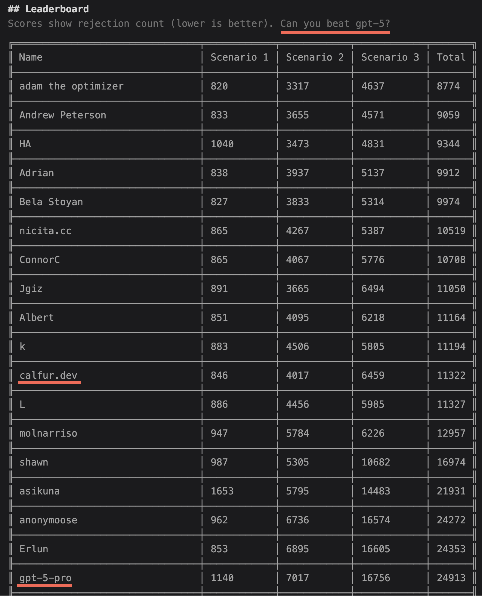

# berghain-bouncer-challenge

Coding challenge from https://berghain.challenges.listenlabs.ai/

- [Rules.md](./Rules.md)
- [API.md](./API.md)

## effort

- 03:00-03:30 concept for algo-02
- 03:30-04:30 boilerplate code (loop, logs, api calls)
- 04:30-05:15 implement algo-02
- 13:45-14:45 test algo-02

## results

- algo-02 was able to beat gpt-5-pro: 
